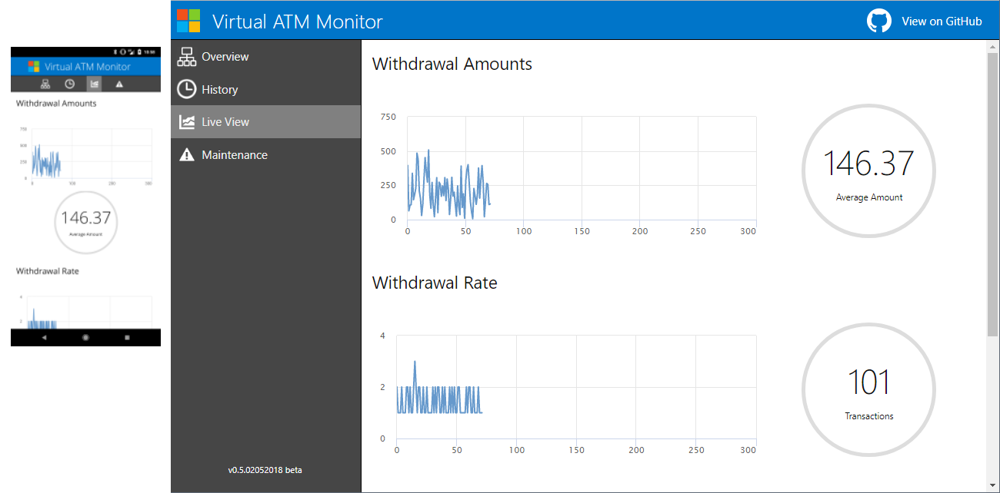
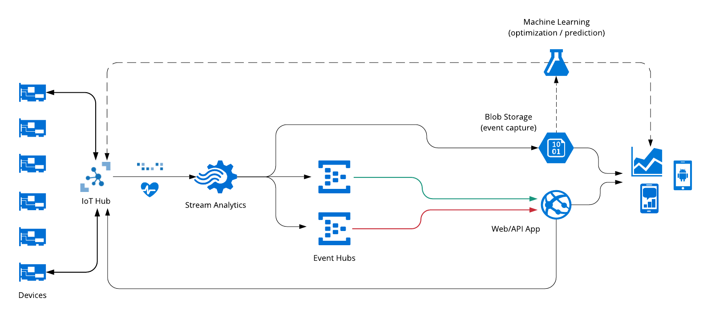
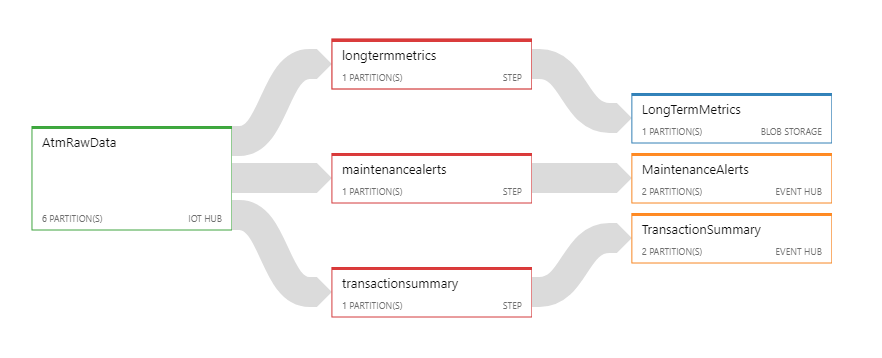
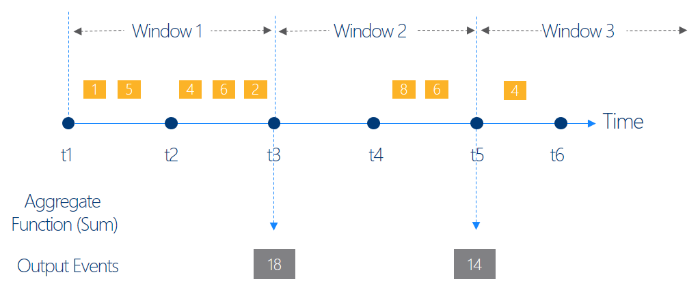
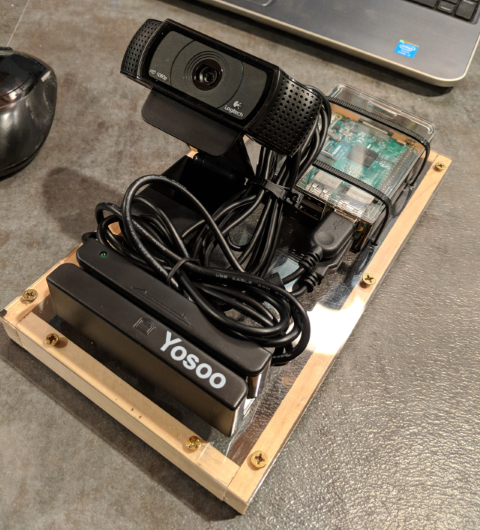

Overview
--------

This project is intended to demonstrate a "virtual ATM" that is augmented and monitored via [Azure IoT Hub](https://docs.microsoft.com/en-us/azure/iot-hub/iot-hub-what-is-iot-hub). 

Features
--------

Here's a screenshot of the web application in action (both desktop and mobile), as well as a shot of the 
Raspberry Pi 3 "ATM":



Architecture
------------

The diagram below outlines the high-level architecture used by the Virtual ATM monitor. Note in this demo, 
Machine Learning is not currently deployed (will be added in later builds), but could be included to provide 
predictive maintenance or other intelligent capabilities.



This design is essentially an implementation of the [Lambda architecture](https://en.wikipedia.org/wiki/Lambda_architecture) style, combining both hot-path (streaming layer) and cold-path (batch layer) data flows into a single serving tier.

Once telemetry data is received by the IoT Hub, it is routed to a Stream Analytics instance that is performing 
windowing queries that quantize/summarize the incoming data stream. The Stream Analytics queries break the raw device 
data into three feeds: one for transaction summaries every 1 second, one for any reported maintenance errors 
every 1 second, and finally a summarized window that reports every 5 minutes (see workflow diagram below).



Each of the Stream Analytics queries are making use of Tumbling Window functions, which allow for operations to be
implemented within defined temporal windows (as shown below):



Hardware
--------

Our hardware for this demo consists of a Raspberry Pi 3, a Yosoo magnetic card reader, and a USB webcam:



Source code for the ATM can be found in the `CardReader` directory.

Setup and Deployment
--------------------

The base environment can be created using the `SetupDeployment.ps1` script, however note that the Stream Analytics job definition 
and the IoT Hub deployment are still missing. I'll add these shortly (see issues).

You will also need to define the following environment variables prior to running (sample below in PowerShell):

```
# For WebApp/eventHubDataReader.js
$env:VirtualAtmEventHubMaint = "--Fill In--"
$env:VirtualAtmEventHubTxn = "--Fill In--"

# For WebApp/ioTHubSender.js
$env:VirtualAtmIotHubOwner = "--Fill In--"

# For CardReader/main.js
$env:VirtualAtmCardReader = "--Fill In--"

# For BulkAtmAgent/agent.js
$env:VirtualAtmBulkAtmAgent = "--Fill In--"
```

Note these environment variables will need set on the deployed web app as well - this can be done via the Azure portal, or
through deployment scripts/VSTS.

Integration with Cognitive Services
-----------------------------------

Currently, the virtual ATM takes a photo at the time of card swipe just to demonstrate the built-in capability 
of IoT Hub to support device file uploads. However, a better demonstration will be to leverage the Face API to 
compare the "cardholder" against a known image to demonstrate fraud protection possibilities. This will be implemented in
an upcoming release.